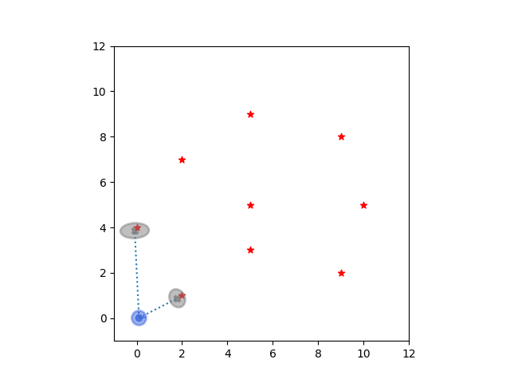

# SlamTutorial.jl 

## Extended Kalman Filter

 [EKF-SLAM notebook tutorial](https://nbviewer.jupyter.org/github/JihongJu/SlamTutorial.jl/blob/9cd57abd00f4f3cb158f88fe1d7442604aa92830/notebooks/EKFSLAM.ipynb) 

